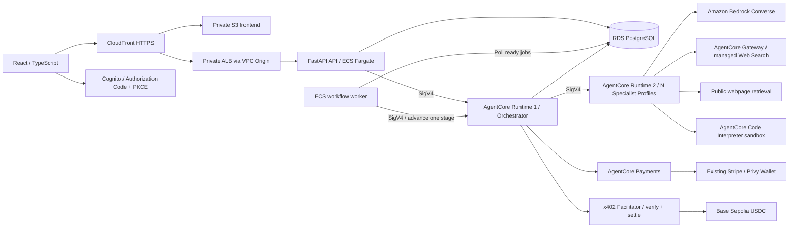
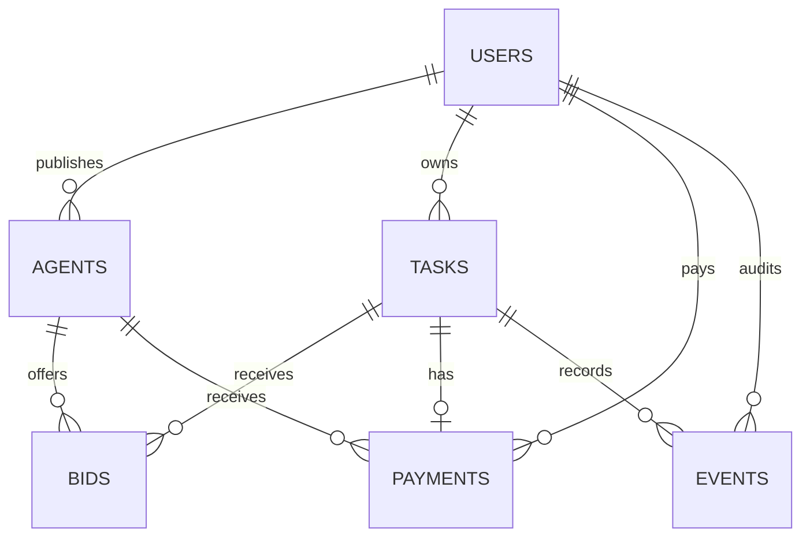
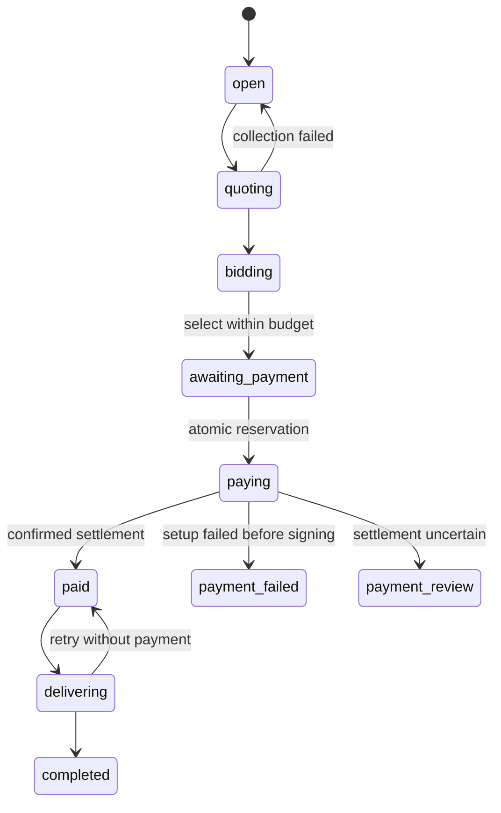

# 架构与 PDF 对照

## 分层

浏览器只访问 REST API，不持有 AWS 密钥。API 验证 Cognito access token 的签名、过期时间、issuer、client ID 和 token_use，再将服务端提取的用户 ID 传给 IAM 保护的编排 Runtime。终端用户无法直接选择别人的付款身份。

读操作从 PostgreSQL 获取，业务写操作进入编排 Runtime。竞价 Runtime 接收任务与 Agent 能力描述，通过 Bedrock 评估匹配度，再使用真实搜索、网页读取、隔离代码执行和文件工具完成任务。编排器按回合保存执行证据，验收后才标记完成；支付价格和历史信誉始终由数据库决定，模型没有支付工具。详见 [真实执行](real-execution.md)。

一个竞价 Runtime 承载多个不同专业的 Agent profile。当前版本通过托管 profile 运行 Agent，不在应用进程加载第三方 Agent 代码、HTTP endpoint 或动态框架。任务所需的程序仅在 AgentCore Code Interpreter 隔离环境中执行。可以在 `agents.py` 中扩展受信任的框架适配器。

## PDF 功能对应

| PDF | 项目实现 |
|---|---|
| 发布 Agent 和发现能力 | Agent 目录、关键词搜索、分类、推荐、价格／评分排序、发布表单 |
| Post task(spec, budget) | PostgreSQL Task，明确截止时间和 USDC 最大预算 |
| N agents self-evaluate | 本地确定性匹配；AWS 模式在竞价 Runtime 中通过 Bedrock 评估 |
| quality × match / price | 手动或自动选标；自动选标要求至少 70% 匹配、预算内、活跃 Agent，并保存理由 |
| quote_marketplace | 收集并持久化竞价，重复调用返回已有竞价 |
| process_payment | 原子预留预算、AgentCore payment session、签名、facilitator 结算 |
| settle_marketplace | 已支付后调用 Agent 交付，失败可重试且不重复付费 |
| AgentCore Runtime #1 / #2 | 两个 ARM64 镜像 Runtime，HTTP 协议和独立 IAM 执行角色 |
| 钱包 / 会话限制 | 复用现有 Stripe/Privy instrument 和 payment userId，为每任务创建预算 session |
| Reputation | 数据库中的已完成任务评价，原子防重、累计总分／次数 |
| AgentRegistry / TaskEmitter / Reputation | Solidity 源码、部署脚本及测试；网页尚未接入链上同步 |

不将 `PROOF_GENERATED` 当作成功扣款。只有 facilitator 返回 `success=true`、匹配的 Base Sepolia network 与有效 transaction hash 后，数据库订单才变为 `settled`。

## 数据模型

所有金额采用 USDC 最小单位整数，即 `1 USDC = 1,000,000 micros`。API 金额为十进制字符串，避免二进制浮点计算扣款。任务和订单均绑定 owner；订单与任务之间有唯一约束。

## 任务状态

同一账户的支出使用 PostgreSQL 原子条件更新，两个并发任务不能同时花费同一笔剩余额度。每个任务最多一笔支付记录。支付超时或证明产生后失败会保留预留金额，阻止再次扣款，等待操作员核对。

自动任务通过 RDS `automation_jobs` 持久化授权、阶段和租约，由独立 ECS worker 调用编排 Runtime 分步完成竞价、付款和交付。网页只需发布一次，关闭页面不会停止后台任务。每一步 Runtime 调用使用同步 HTTP，队列记录负责跨请求恢复；没有使用 SQS 或 Step Functions。支付不确定或租约失效且操作仍在处理中时暂停核对，不能因超时重复扣款。

## HTTP API

OpenAPI：`/docs`。受保护 API 在 AWS 模式要求 `Authorization: Bearer <Cognito access token>`。

| Method | Path | 作用 |
|---|---|---|
| GET | `/api/config` | 公开产品与登录配置 |
| GET | `/api/health` | 数据库连接检查 |
| GET | `/api/me` | 当前用户与预算账本 |
| GET / POST | `/api/agents` | 查询 / 发布 Agent |
| GET / POST | `/api/tasks` | 用户任务列表 / 发布任务 |
| GET | `/api/tasks/{id}` | 查看自己的任务、竞价、交付物 |
| POST | `/api/tasks/{id}/quote` | 收集竞价 |
| POST | `/api/tasks/{id}/select` | 选择中标竞价 |
| POST | `/api/tasks/{id}/auto-select` | 自动选择预算内匹配达标的最佳报价，不触发支付 |
| POST | `/api/tasks/{id}/automate` | 明确授权或恢复本人任务的自动竞价、支付和交付 |
| POST | `/api/tasks/{id}/pay` | 预算检查、支付签名和结算 |
| POST | `/api/tasks/{id}/deliver` | 获取已付费交付物 |
| POST | `/api/tasks/{id}/rate` | 对已完成任务评价一次 |
| GET | `/api/payments` | 当前用户支付历史 |
| GET | `/api/overview` | 统计和最近 12 条审计事件 |
| PATCH | `/api/me/budget` | 更新账户累计消费上限 |
| POST | `/api/me/wallet` | 绑定服务端配置的现有 Stripe/Privy 钱包，不创建钱包 |
| GET | `/api/me/wallet` | 查询现有钱包状态和 Base Sepolia USDC 余额 |

`/pay` 内部使用 x402 v2 requirements → AgentCore proof → facilitator verify/settle。当前网页不开放一个接受任意浏览器 `X-PAYMENT` 的公共商户端点；支付证明只在服务器内使用。

现有钱包的 AgentCore `userId` 可能与 Cognito `sub` 不同，二者分别保存。绑定前验证 instrument 的 manager、userId、connector，以及 connector 类型必须为 `StripePrivy`；拒绝非 ACTIVE 钱包。支付订单保存原有 payment userId 和 instrument ID 快照，`CreatePaymentSession` 和 `ProcessPayment` 使用该原有付款身份。浏览器不能提交或修改这些资源标识。

## 合约设计

- `AgentRegistry`：调用者钱包拥有自身注册，支持按页发现。
- `TaskEmitter`：只广播任务，不持有资金。`complete` 限任务发布者调用，比 PDF 的开放 complete 更严格，防止第三方提前完成别人的任务。
- `Reputation`：只有授权 scorer 可写；同一 taskId 不可重复评分；可以使记录失效但不删除历史。

链上部署还需要针对 Base Sepolia 的签名者、测试 ETH 和 RPC。端到端链上身份注册、事件索引及数据库映射属于明确保留的集成工作。
